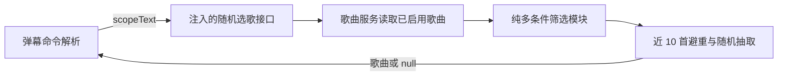

# ADR-001: 随机点歌支持多条件组合筛选

## 状态

已接受

## 需求

- `随机点歌 国语+周杰伦+抒情` 只在歌库中同时满足全部条件的已启用歌曲里随机。
- 每个条件可命中歌曲的语言、歌手、分类或标签。
- 任一条件不满足时不入队，且不记录成功点歌冷却。
- 兼容不带条件和只带一个条件的现有随机点歌语法。
- 筛选逻辑不依赖 Bilibili、数据库或队列模块。

## 决策

新增纯函数模块 `src/music/random-song-filter.js`。歌曲服务从数据库读取已启用歌曲后，把普通歌曲对象和弹幕中的筛选文本交给该模块；模块按 `+` 或 `＋` 拆分条件并执行 AND 筛选。

单个条件按以下规则匹配任一字段：

1. 歌手：保留完整歌手名匹配，并拆分 `/` 或 `&` 连接的合唱歌手后忽略大小写完整匹配。
2. 语言：先拆分 `/`、顿号或逗号连接的混合语言，再支持现有语言别名后完整匹配。
3. 分类：先按 `/` 拆成独立分类，再以标准名称或明确别名完整匹配。
4. 标签：先按逗号、顿号、分号或竖线拆成独立标签，再忽略大小写完整匹配。匹配前由独立的 `src/music/tag-aliases.js` 把观众叫法单向解析到歌库标准标签。

别名模块只接收歌库完整标签和观众输入并返回是否匹配，不依赖随机点歌、数据库、弹幕或队列。首批标准标签与常见叫法为：

- `抒情` ← `情歌、抒情歌、抒情歌曲、慢情歌`
- `治愈` ← `治愈系、治愈向、治愈歌曲、暖心`
- `怀旧` ← `怀旧歌、怀旧歌曲、回忆杀、经典老歌、老歌`
- `国风` ← `中国风`
- `小甜歌` ← `甜歌`
- `影视OST` ← `OST、影视原声、原声带`
- `K-Pop` ← `KPOP、K POP、韩国流行、韩流`

箭头左侧必须是歌库实际采用的标准标签。映射是单向的，例如观众输入“情歌”可命中歌库标签“抒情”，但歌库中误写为“情歌”的歌曲不会因观众输入“抒情”而被反向命中。模块不使用子串、相似度或自动语义推断，也不收录“经典、温柔、慢歌、好听”等范围过宽的叫法。

## 备选方案

- 动态拼 SQL：查询更靠近数据库，但跨语言别名、分类、歌手和分隔标签的组合 SQL 难以维护和独立测试。
- 强制 `语言:国语` 等有类型语法：匹配更明确，但增加观众输入成本且不兼容用户期望的自然写法。
- 条件逐级降级：更容易得到结果，但违反“所有 tag 都不满足就忽略”的明确要求。
- 模糊匹配或自动语义扩展：能覆盖更多自然叫法，但边界不可控，会破坏组合条件的确定性，因此只采用指向歌库标准标签的显式别名。

## 后果与风险

- 正面：筛选模块零副作用、可单测，弹幕层与数据库继续通过注入接口隔离。
- 代价：组合筛选会先读取全部已启用歌曲再在内存中过滤。当前本地点歌库规模下实现更简单可靠；若未来达到超大歌库规模，再依据实测改为规范化标签表和 SQL 查询。
- 安全：全部数据库查询保持静态 SQL，不拼接用户输入。
